[[TOC]]

<div style="page-break-after: always;"></div>

# Repetições

!!! info info
    Em algumas situações alguns trechos dos algoritmos precisam ser executados mais de uma vez.
A quantidade de vezes depende de uma condição lógica. 

- Trocar uma lâmpada.
    - Pegar uma escada;
    - ...
    - Descer da escada;
    - Ligar o interruptor.
    - ENQUANTO a lâmpada não acender , FAÇA
        - Desligar o interruptor;
        - Buscar uma nova lâmpada;
        - Subir a escada;
        - Retirar a lâmpada queimada;
        - Colocar a lâmpada nova;
        - Descer da escada;
        - Ligar o interruptor.

<div style="page-break-after: always;"></div>




<div style="page-break-after: always;"></div>

```mermaid
graph TD
A(Bloco 1) --> D{Condição <br/> de parada}

    D --S--> E(Bloco 2)
    E --> D
    D --N--> G(( ))

G(( ))-->H(Bloco 3)

classDef orange fill:#f96,stroke:#333,stroke-width:2px;
class D orange
classDef black fill:#000;
class G black
```

Supondo um programa que deve verificar se a cada um dos 3 número informados é par ou impar.

Como seria esse algoritmo?

```mermaid
graph TD
subgraph verificando numero par uma vez
    A(Leia numero ) --> D{numero mod 2 = 0}

        D --S--> E(é par)
        
        D --N--> F(é impar)

    E-->G(( ))
    F-->G(( ))
end
G(( )) --> A1
subgraph verificando numero par segunda vez
    A1(Leia numero ) --> D1{numero mod 2 = 0}

        D1 --S--> E1(é par)
        
        D1 --N--> F1(é impar)

    E1-->G1(( ))
    F1-->G1(( ))
end

G1(( )) --> A2
subgraph verificando numero par terceira vez
    A2(Leia numero ) --> D2{numero mod 2 = 0}

        D2 --S--> E2(é par)
        
        D2 --N--> F2(é impar)

    E2-->G2(( ))
    F2-->G2(( ))
end

classDef orange fill:#f96,stroke:#333,stroke-width:2px;
class D,D1 orange
classDef black fill:#000;
class G,G1 black
```

<details open>
<summary>Exemplo Fluxo</summary>


</details>
<div style="page-break-after: always;"></div>

## Enquanto

!!! note Teste lógico no início da repetição (loop)

```php
enquanto <expressão-lógica> faca 
    <sequência-de-comandos>
fimenquanto
```

Esta estrutura repete uma sequência de comandos enquanto uma determinada condição (especificada através de uma expressão lógica) for satisfeita.

### Exemplo

1. Determinar a quantidade de divisores de um número inteiro qualquer

<details open>
<summary>Exemplo código</summary>

```php
leia(numero)
divisor <- 1
quantidadeDivisor <- 0
**enquanto** (divisor <= numero) faca
    se ((numero % divisor) = 0) entao
        quantidadeDivisor <- quantidadeDivisor + 1
    fimse
divisor <- divisor + 1
fimenquanto
escreva(quantidadeDivisor)
```
</details>
<div style="page-break-after: always;"></div>

## Repita

!!! note Teste lógico no final da repetição (loop)

```php
repita
    <sequência-de-comandos>
ate <expressão-lógica>
```

Esta estrutura repete uma sequência de comandos até uma determinada condição (especificada através de uma expressão lógica) for satisfeita.

### Exemplo

1. Ler uma quantidade indefinida de números e  escrever a média aritmética. A leitura deve parar quando o número 0 for informado.

<details open>
<summary>Exemplo código</summary>

```php
quantidadeNumero <- 0
total <- 0
repita
    leia(numero)
    total <- total + numero
    quantidadeNumero <- quantidadeNumero + 1
ate (numero = 0)
escreva (total/(quantidadeNumero-1))
```
</details >
<div style="page-break-after: always;"></div>


## Para

!!! note Repetição com variável de controle

```php
para <variável> de <valor-inicial> ate <valor-limite> [passo <incremento>] faca
   <seqüência-de-comandos>
fimpara
```

Essa estrutura de repetição é utilizada quando se sabe a quantidade de vezes que as ações serão repetidas

### Exemplo

1. Ler um número e exibir a tabuada de multiplicação desse número

<details open>
<summary>Exemplo de código</summary>

```php
Algoritmo "tabuada"
Var
   numero,contador :inteiro
Inicio
leia(numero)
//passo 1 é desnecessário 
para contador de 1 ate 10 faca
    escreval (contador, " x ", numero, " = ", contador * numero )
fimpara
Fimalgoritmo
```
</details>

<div style="page-break-after: always;"></div>

## Exercícios 

1. Elabore um algoritmo que escreva os números de 1 a 20 utilizando estrutura de repetição
1. Elabore um algoritmo que resolva a multiplicação utilizando apenas soma. Exemplo: 12 x 4 (o programa deve ler o numero 12 e o numero 4 e mostrar o resultado 48)
1. Elabore um algoritmo que resolva a divisão utilizando apenas soma e subtração. Exemplo: 11 : 2 (o programa deve solicitar os valores 11 e 2 e exibir o resultado 5 e resto 1)


<div style="page-break-after: always;"></div>

## Encadeamento de estruturas de repetição


!!! note Qualquer estrutura de repetição pode ser encadeada por outra.

Dentro de um **para**, **enquanto** ou **repita** podem existir outras estruturas de repetição assim como vimos nas condicionais.

<div style="page-break-after: always;"></div>

### Exercício
1. Escreva o algoritmo para exibir a tabuada de Pitágoras.

| X  | 0 | 1  | 2  | 3  | 4  | 5  | 6  | 7  | 8  | 9  | 10  |
| -- | - | -- | -- | -- | -- | -- | -- | -- | -- | -- | --- |
| 0  | 0 | 0  | 0  | 0  | 0  | 0  | 0  | 0  | 0  | 0  | 0   |
| 1  | 0 | 1  | 2  | 3  | 4  | 5  | 6  | 7  | 8  | 9  | 10  |
| 2  | 0 | 2  | 4  | 6  | 8  | 10 | 12 | 14 | 16 | 18 | 20  |
| 3  | 0 | 3  | 6  | 9  | 12 | 15 | 18 | 21 | 24 | 27 | 30  |
| 4  | 0 | 4  | 8  | 12 | 16 | 20 | 24 | 28 | 32 | 36 | 40  |
| 5  | 0 | 5  | 10 | 15 | 20 | 25 | 30 | 35 | 40 | 45 | 50  |
| 6  | 0 | 6  | 12 | 18 | 24 | 30 | 36 | 42 | 48 | 54 | 60  |
| 7  | 0 | 7  | 14 | 21 | 28 | 35 | 42 | 49 | 56 | 63 | 70  |
| 8  | 0 | 8  | 16 | 24 | 32 | 40 | 48 | 56 | 64 | 72 | 80  |
| 9  | 0 | 9  | 18 | 27 | 36 | 45 | 54 | 63 | 72 | 81 | 90  |
| 10 | 0 | 10 | 20 | 30 | 40 | 50 | 60 | 70 | 80 | 90 | 100 |

<div style="page-break-after: always;"></div>


```
algoritmo "tabuadapitagoras"
var
     contadorLinha, contadorColuna : inteiro
Inicio
escreva("  X | ")
para contadorColuna de 0 ate 10 faca
    escreva(contadorColuna, " | ")
fimpara
escreval()
para contadorLinha de 0 ate 10 faca
     escreva(contadorLinha, " | ")
     para contadorColuna de 0 ate 10 faca
          escreva(contadorColuna * contadorLinha, " | ")
     fimpara
     escreval()
fimpara
```


