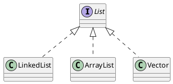

Java Collections{style="font-size: 5rem; margin-top: 4em;margin-left: auto;margin-right: auto; width: 10em;text-align: center;"}

<div style="page-break-after: always;"></div>

[[TOC]]

<div style="page-break-after: always;"></div>

Quando uma aplicação precisa manipular uma quantidade grande de dados, ela deve utilizar alguma estrutura de dados. Podemos dizer que a estrutura de dados mais básica do Java são os arrays.

Muitas vezes, trabalhar diretamente com arrays não é simples dado as diversas limitações que eles possuem. A limitação principal é a capacidade fixa, um array não pode ser redimensionado. Se todas as posições de um array estiverem ocupadas não podemos adicionar mais elementos. Normal- mente, criamos um outro array com maior capacidade e transferimos os elementos do array antigo para o novo.


Além disso, adicionar ou remover elementos provavelmente gera a necessidade de deslocar parte do conteúdo do array.

As dificuldades do trabalho com array podem ser superadas com estruturas de dados mais sofisticadas. Na biblioteca do Java, há diversas estruturas de dados que facilitam o trabalho do desenvolvedor.

<div style="page-break-after: always;"></div>

## Listas

Um primeiro recurso que a API de `Collections` traz são listas. Uma lista é uma coleção que permite elementos duplicados e mantém uma ordenação específica entre os elementos.

Em outras palavras, você tem a garantia de que, quando percorrer a lista, os elementos serão encontrados em uma ordem pré-determinada, definida na hora da inserção dos mesmos. Ela resolve todos os problemas que levantamos em relação ao array (busca, remoção, tamanho “infinito”,...). Esse código já está pronto!

A API de `Collections` traz a interface `java.util.List`, que especifica o que uma classe deve ser capaz de fazer para ser uma lista. Há diversas implementações disponíveis, cada uma com uma forma diferente de representar uma lista.

A implementação mais utilizada da interface List é a ArrayList, que trabalha com um array interno para gerar uma lista. Portanto, ela é mais rápida na pesquisa do que sua concorrente, a LinkedList, que é mais rápida na inserção e remoção de itens nas pontas.

!!! note ArrayList não é um array!
    É comum confundirem uma ArrayList com um array, porém ela não é um array. O que ocorre é que, internamente, ela usa um array como estrutura para armazenar os dados, porém este atributo está propriamente encapsulado e você não tem como acessá-lo. Perceba que você não pode usar [] com uma ArrayList, nem acessar atributo length. Não há relação!


Para criar um ArrayList, basta chamar o construtor:
```java
ArrayList lista = new ArrayList();
```
É sempre possível abstrair a lista a partir da interface List:
```java
List lista = new ArrayList();
```
Para criar uma lista de nomes (String), podemos fazer:
```java
List lista = new ArrayList();
lista.add("Manoel");
lista.add("Joaquim");
lista.add("Maria");
```
A interface List possui dois métodos add, um que recebe o objeto a ser inserido e o coloca no nal da lista, e um segundo que permite adicionar o elemento em qualquer posição da mesma. Note que, em momento algum, dizemos qual é o tamanho da lista; podemos acrescentar quantos elementos quisermos, que a lista cresce conforme for necessário.

Toda lista (na verdade, toda Collection) trabalha do modo mais genérico possível. Isto é, não há uma ArrayList específica para Strings, outra para Números, outra para Datas etc. Todos os métodos trabalham com Object.

Assim, é possível criar, por exemplo, uma lista de Contas Correntes:

```java
ContaCorrente c1 = new ContaCorrente();
c1.deposita(100);
ContaCorrente c2 = new ContaCorrente();
c2.deposita(200);
ContaCorrente c3 = new ContaCorrente();
c3.deposita(300);
List contas = new ArrayList();
contas.add(c1);
contas.add(c3);
contas.add(c2);
```

Para saber quantos elementos há na lista, usamos o método size():
```java
System.out.println(contas.size());
```
Há ainda um método get(int) que recebe como argumento o índice do elemento que se quer recuperar. Através dele, podemos fazer um for para iterar na lista de contas:

```java
for (int i = 0; i < contas.size(); i++) {
    contas.get(i); // código não muito útil....
}
```

Mas como fazer para imprimir o saldo dessas contas? Podemos acessar o `getSaldo()` diretamente após fazer `contas.get(i)`? Não podemos; lembre-se que toda lista trabalha sempre com `Object`. Assim, a referência devolvida pelo `get(i)` é do tipo `Object`, sendo necessário o cast para ContaCorrente se quisermos acessar o `getSaldo()`:

```java
for (int i = 0; i < contas.size(); i++) {
    ContaCorrente cc = (ContaCorrente) contas.get(i);
    System.out.println(cc.getSaldo());
}
// note que a ordem dos elementos não é alterada
```

Há ainda outros métodos, como remove() que recebe um objeto que se deseja remover da lista; e contains(), que recebe um objeto como argumento e devolve true ou false, indicando se o elemento está ou não na lista.

A interface List e algumas classes que a implementam podem ser vistas no diagrama a seguir:



*Simplificação do diagrama de classes da interface List [^1]*{class="figcaption"}
:::table-responsive

| Nome       |      Tipo       |
| ---------- | :-------------: |
| List       |    Interface    |
| LinkedList | Classe Concreta |
| ArrayList  | Classe Concreta |
| Vector     | Classe Concreta |
[Classificação dos elementos da Figura 1]

:::

[^1]: https://www.caelum.com.br/