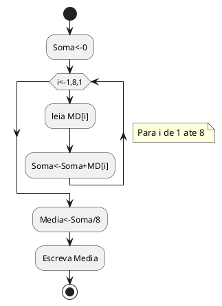
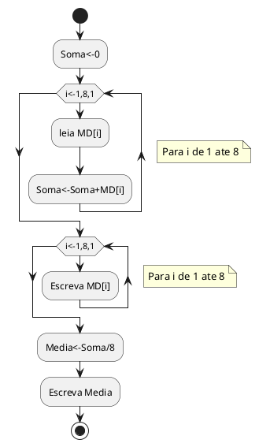
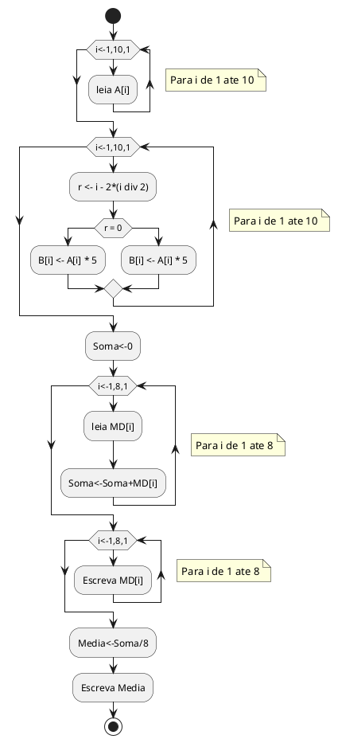
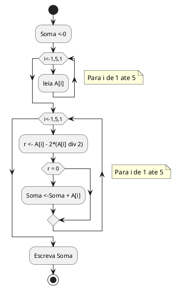
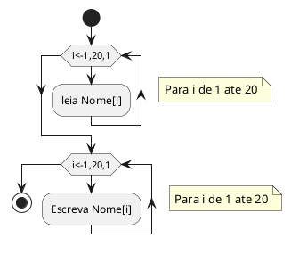

[[TOC]]

<div style="page-break-after: always;"></div>

# Estrutura de Dados Homogêneas I

- Agora será apresentada uma técnica de programação que permitirá trabalhar com o agrupamento
de várias informações dentro de uma mesma variável. Vale salientar que esse agrupamento ocorrerá
obedecendo sempre ao mesmo tipo de dado, e por esta razão é chamado de estrutura de dados
homogênea. 

- A utilização deste tipo de estrutura de dados recebe diversos nomes, como: *variáveis indexadas,* *variáveis compostas,* *variáveis subscritas,* *arranjos,* *vetores,* *matrizes,* *tabelas em memória* ou *arrays* (do inglês). 

- São vários os nomes encontrados na literatura voltada para o estudo de técnicas de programação que envolvem a utilização das estruturas homogêneas de dados. Por nós, serão definidas como ==matrizes==.
- As matrizes (tabelas em memória principal) são tipos de dados que podem ser "construídos" à medida que se fazem necessários, pois não é sempre que os tipos básicos (real, inteiro, caractere e lógico) e/ou variáveis simples são suficientes para representar a estrutura de dados utilizada em um programa.

<div style="page-break-after: always;"></div>

# Matrizes de uma Dimensão ou Vetores

-Este tipo de estrutura em particular é também denominado por alguns profissionais como matrizes unidimensionais. Sua utilização mais comum está vinculada à criação de tabelas. Caracteriza-se por ser definida uma única variável dimensionada com um determinado tamanho. A dimensão de uma matriz é constituída por constantes inteiras e positivas. Os nomes dados às matrizes seguem as mesmas regras de nomes utilizados para indicar as variáveis simples.

-Para ter uma idéia de como utilizar matrizes em um determinada situação, considere o seguinte problema: “Calcular a média geral de uma turma de 8 alunos. A média a ser obtida deve ser a média geral das médias de cada aluno obtida durante o ano letivo”. Desta forma será necessário somar todas as média e dividi-las por 8. A tabela seguinte apresenta o número de alunos, suas notas bimestrais e respectivas médias anuais. É da média de cada aluno que será efetuado o cálculo da média da turma.

<div style="page-break-after: always;"></div>


| Aluno | Nota1 | Nota2 | Nota3 | Nota4 | Media |
| :---: | ----: | ----: | ----: | ----: | ----: |
| 1     | 4,0   | 6,0   | 5,0   | 3,0   | 4,5   |
| 2     | 6,0   | 7,0   | 5,0   | 8,0   | 6,5   |
| 3     | 9,0   | 8,0   | 9,0   | 6,0   | 8,0   |
| 4     | 3,0   | 5,0   | 4,0   | 2,0   | 3,5   |
| 5     | 4,0   | 6,0   | 6,0   | 8,0   | 6,0   |
| 6     | 7,0   | 7,0   | 7,0   | 7,0   | 7,0   |
| 7     | 8,0   | 7,0   | 6,0   | 5,0   | 6,5   |
| 8     | 6,0   | 7,0   | 2,0   | 9,0   | 6,0   |


Agora basta escrever um programa para efetuar o cálculo das 8 médias de cada aluno. Para representar a média do primeiro aluno será utilizada a variável `MD1`, para o segundo `MD2` e assim por diante. Então se tem:

```
MD1 <- 4.5
MD2 <- 6.5
MD3 <- 8.0
MD4 <- 3.5
MD5 <- 6.0
MD6 <- 7.0
MD7 <- 6.5
MD8 <- 6.0
```

Com o conhecimento adquirido até este momento, seria então elaborado um programa que efetuaria a
leitura de cada nota, a soma delas e a divisão do valor da soma por 8, obtendo-se desta forma a média conforme exemplo abaixo em português estruturado:

```php
algoritmo "Media_Turma"
var
    MD1, MD2, MD3, MD4, MD5, MD6, MD7, MD8: real
    SOMA, MEDIA: real
inicio
    SOMA <- 0
    leia(MD1, MD2, MD3, MD4, MD5, MD6, MD7, MD8)
    SOMA <- MD1 + MD2 + MD3 + MD4 + MD5 + MD6 + MD7 + MD8
    MEDIA <- SOMA / 8
    escreva(MEDIA)
fimalgoritmo
```

Perceba que para receber a média foram utilizadas oito variáveis. Com a técnica de matrizes poderia ter sido utilizada apenas uma variável com a capacidade de armazenar oito valores.

## Operações Básicas com Matrizes do Tipo Vetor

Uma matriz de uma dimensão ou vetor será, neste trabalho, representada por seu nome e seu tamanho (dimensão) entre colchetes. Desta forma seria uma matriz `MD[1..8]`, sendo seu nome `MD`, possuindo um tamanho de 1 a 8. Isto significa que poderão ser armazenados em MD até oito elementos. Perceba que na utilização de variáveis simples existe uma regra: uma variável somente pode conter um valor por vez. No caso das matrizes, poderão armazenar mais de um valor por vez, pois são dimensionadas exatamente para este fim. Desta forma poder-se-á manipular uma quantidade maior de informação com pouco trabalho de processamento. Deve-se apenas considerar que com relação à manipulação dos elementos de uma matriz, eles ocorrerão de forma individualizada, pois não é possível efetuar a manipulação de todos os elementos do conjunto ao mesmo tempo. No caso do exemplo do cálculo da média dos 8 alunos, ter-se-ia então uma única variável indexada (a matriz) contendo todos os valores das 8 notas. isto seria representado da seguinte forma:

```
MD[1] <- 4.5
MD[2] <- 6.5
MD[3] <- 8.0
MD[4] <- 3.5
MD[5] <- 6.0
MD[6] <- 7.0
MD[7] <- 6.5
MD[8] <- 6.0
```

Observe que o nome é um só. O que muda é a informação indicada dentro dos colchetes. A esta
informação dá-se o nome de índice, sendo este o endereço em que o elemento está armazenado. É
necessário que fique bem claro que elemento é o conteúdo da matriz, neste caso os valores das notas. No caso de `MD[1] = 4.5`, o número 1 é o índice; o endereço cujo elemento é 4.5 está armazenado.

### Atribuição de uma Matriz
Anteriormente, foram utilizadas várias instruções em português estruturado para poder definir e montar um programa. No caso da utilização de matrizes, será definida a instrução vetor que indicará em português estruturado a utilização de uma matriz, tendo como `sintaxe: VARIÁVEL: VETOR[<dimensão>]` de `<tipo de dado>,` sendo `que <dimensão>` será a indicação dos valores inicial e final do tamanho do vetor e `<tipo de dado>` se o vetor em questão irá utilizar valores reais, inteiros, lógicos ou caracteres.

### Leitura dos Dados de uma Matriz
A leitura de uma matriz é processada passo a passo, um elemento por vez. A instrução de leitura é `leia()` seguida da variável mais o índice. A seguir, são apresentados diagramas de blocos e codificação em português estruturado da leitura das notas dos 8 alunos, cálculo da média e a sua apresentação.

<details open>
<summary>Diagrama de Blocos</summary>



</details>

<details open>
<summary>Português Estruturado</summary>

```
algoritmo "Media_turma"
var
    MD: vetor[1..8] de real
    SOMA, MEDIA: real
    I: inteiro
inicio
    SOMA <- 0
    para I de 1 ate 8 passo 1 faca
        leia(MD[I])
        SOMA <- SOMA + MD[I]
    fimpara
    MEDIA <- SOMA / 8
    escreva(MEDIA)
fimalgoritmo
```

</details>

Veja que o programa ficou mais compacto, além de possibilitar uma mobilidade maior, pois se houver a necessidade de efetuar o cálculo para um número maio de alunos, basta dimensionar a matriz e mudar o valor final da instrução para. Observe que no exemplo anterior, a leitura é processada uma por vez. Desta forma, a matriz é controlada pelo número do índice que faz com que cada entrada aconteça em uma posição diferente da outra. Assim sendo, a matriz passa a ter todas as notas. A tabela seguinte, mostra como ficarão os valores armazenados na matriz.


|     Matriz: MD   ||
| Índice | Elemento |
| :----: | :------: |
| 1      |      4.5 |
| 2      |      6.5 |
| 3      |      8.0 |
| 4      |      3.5 |
| 5      |      6.0 |
| 6      |      7.0 |
| 7      |      6.5 |
| 8      |      6.0 |

Tenha cuidado para não confundir o índice com o elemento. Índice é o endereço de alocação de uma unidade da matriz, enquanto elemento é o conteúdo armazenado em um determinado endereço.

### Escrita dos Dados de uma Matriz

O processo de escrita de uma matriz é bastante parecido com o processo de leitura de seus elementos. Para esta ocorrência deverá ser utilizada a instrução escreva() seguida da indicação da variável e seu índice. Supondo que após a leitura das 8 notas, houvesse a necessidade de apresenta-las antes da apresentação do valor da média.

<details open>
<summary>Diagrama de Blocos</summary>



</details>


<details open>
<summary>Português Estruturado</summary>


```
algoritmo "Media_turma"
var
    MD: vetor[1..8] de real
    SOMA, MEDIA: real
    i: inteiro
inicio
    SOMA <- 0
    para i de 1 ate 8 passo 1 faca
        leia(MD[i])
        SOMA <- SOMA + MD[i]
    fimpara
    para i de 1 ate 8 passo 1 faca
        escreval(MD[i])
    fimpara
    MEDIA <- SOMA / 8
    escreva(MEDIA)
fimalgoritmo
```
</details>

6.3 – Exercício de Aprendizagem

### 1.Exemplo
Desenvolver um programa que efetue a leitura de dez elementos de uma matriz A tipo vetor. Construir uma matriz B de mesmo tipo, observando a seguinte lei de formação: se o valor do índice for par, o valor deverá ser multiplicado por 5, sendo ímpar, deverá ser somando com 5. Ao final mostrar o conteúdo da matriz B.

Algoritmo
Este exemplo de resolução estará mostrando como fazer o tratamento da condição do índice.
1. Iniciar o contador de índice, variável I com 1 em um contador até 10;
2. Ler os 10 valores, um a um;
3. Verificar se o índice é par se sim multiplica por 5, se não soma 5. Criar a matriz B;
4. Apresentar os conteúdos das duas matrizes.

Deverá ser perguntado se o valor do índice `I` em um determinado momento é para (ele será par quando dividido pro 2 obtiver resto igual a zero). Sendo a condição verdadeira, será implicada na matriz `B[i]` a multiplicação do elemento da matriz  `A[i]` por `5`. Caso o valor do índice `I` seja ímpar, será implicada na matriz B[i] a soma do elemento da matriz `A[i]` por `5`.





Português Estruturado
```
algoritmo "Indice_par_ou_impar"
var
    A, B: vetor[1..10] de real
    i, r: inteiro
inicio
    para i de 1 ate 10 passo 1 faca
        leia(A[i])
    fimpara
    para i de 1 ate 10 passo 1 faca
        r <- i - 2*(i div 2)
        se (r = 0) entao
            B[i] <- A[i] * 5
        senao
            B[i] <- A[i] + 5
        fimse
    fimpara
    para i de 1 ate 10 passo 1 faca
        escreval(B[i])
    fimpara
fimalgoritmo
```


### 2.Exemplo
Desenvolver um programa que efetue a leitura de cinco elementos de uma matriz A do tipo vetor. No final, apresente o total da soma de todos os elementos que sejam ímpares.

Perceba que em relação ao primeiro exemplo, este apresenta uma diferença: o primeiro pedia para verificar se o índice era par ou ímpar. Neste exemplo, está sendo solicitado que analise a condição do elemento e não do índice. Já foi alertado anteriormente para se tomar cuidado para não confundir elemento com índice.

Veja a solução.
1. Iniciar o contador de índice, variável i como 1 em um contador até 5;
2. Ler os 5 valores, um a um;;
3. Verificar se o elemento é ímpar; se sim efetuar a soma dos elementos;
4. Apresentar o total somado de todos os elementos ímpares da matriz.


Observe que quando se faz menção ao índice indica-se a variável que controla o contador de índice, e no caso do exemplo anterior, a variável `i`. Quando se faz menção ao elemento, indica-se: `A[i],` pois desta forma está se pegando o valor armazenado e não a sua posição de endereço.





Português Estruturado
```
algoritmo "Elemento_impar"
var
  A: vetor[1..5] de inteiro
  i, R, SOMA: inteiro
inicio
  soma <- 0
  para i de 1 ate 5 passo 1 faca
    leia(A[i])
  fimpara
  para i de 1 ate 5 passo 1 faca
    R <- A[i] - 2*(A[i] div 2)
    se (R <> 0) entao
      SOMA <- SOMA + A[i]
    fimse
  fimpara
  escreva(SOMA)
fimalgoritmo
```


# Aplicações Práticas do Uso de Matrizes do Tipo Vetor

A utilização de matrizes em programação é bastante ampla. Podem ser utilizadas em diversas situações, tornando bastante útil e versátil esta técnica de programação. Para ter uma idéia, considere o seguinte problema: “Criar um programa que efetue a leitura dos nomes de 20 pessoas e em seguida apresenta-los na mesma ordem em que foram informados”.

Algoritmo
1. Definir a variável i do tipo inteiro para controlar a malha de repetição;
2. Definir a matriz NOME do tipo literal para 20 elementos;
3. Iniciar o programa, fazendo a leitura dos 20 nomes;
4. Apresentar após a leitura, os 20 nomes.
Diagrama de Blocos



Português Estruturado
```
algoritmo "Lista_Nome"
var
  NOME: vetor[1..20] de literal
  i: inteiro
inicio
  para i de 1 ate 20 faca
    leia(NOME[i])
  fimpara
  para i de 1 ate 20 faca
    escreval(NOME[i])
  fimpara
fimalgoritmo
```

O programa anterior executa a leitura e a escrita de 20 nomes. Perceba que será apresentada a relação dos nomes da mesma forma em que foi informada para o trecho de entrada.


## Classificação dos Elementos de uma Matriz

Tendo construído o programa de entrada e saída dos 20 nomes na matriz, seria bastante útil que, antes de apresenta-los, o programa efetuasse o processamento da classificação alfabética, apresentando os nomes em ordem, independentemente daquela em que foram informados, facilitando desta forma a localização de algum nome, quando for efetuada uma pesquisa visual.

Existem vários métodos para obter a ordenação de elementos de uma matriz. Aqui será apresentado um método bastante simples de ordenação que consiste na comparação de cada elemento com todos os elementos subseqüentes. Sendo o elemento comparado menor para ordenação decrescente, ou maior para ordenação crescente que o atual, ele será trocado de posição com o outro. A ordenação considerada é alfabética, devendo essa ser crescente, ou seja, de A até Z.

A seguir, é apresentado o programa completo com a parte de entrada de dados na matriz, o processamento da ordenação e a apresentação dos dados ordenados. Mas somente o trecho de ordenação será comentado, uma vez que a entrada e a saída dos elementos já foram comentados anteriormente.

Algoritmo
1. Definir a variável i do tipo inteira para controlar a malha de repetição;
2. Definir a matriz NOME do tipo literal para 20 elementos;
3. Iniciar o programa, fazendo a leitura dos 20 nomes;
4. Colocar em ordem crescente os elementos da matriz;
5. Apresentar após a leitura, os 20 nomes ordenados.

É importante que se estabeleça adequadamente o quarto passo do algoritmo, ou seja, como fazer para colocar os elementos em ordem crescente. Foi informado que basta comparar um elemento com os demais subseqüentes. Isto é verdade, mas necessita ser feito com alguma cautela.

Imagine um problema um pouco menor: “Colocar em ordem crescente 5 valores numéricos armazenados numa matriz A e apresenta-los”. Considere para esta explicação os valores apresentados na tabela a seguir:

|         Matriz A         ||
| Índice i | Elemento: A[i] |
| :------: | :------------: |
|    1     |       9        |
|    2     |       8        |
|    3     |       7        |
|    4     |       5        |
|    5     |       3        |

<div style="page-break-after: always;"></div>

Os valores estão armazenados na ordem: 9, 8, 7, 5 e 3 e deverão ser apresentados na ordem 3. 5, 7, 8 e 9.


Para efetuar o processo de troca, é necessário aplicar o método de propriedade distributiva. Sendo assim, o elemento que estiver em A[1] deverá ser comparado com os elementos que estiverem em A[2], A[3], A[4] e A[5]. Depois, o elemento que estiver em A[2] não necessita ser comparado com o elemento que estiver em A[1], pois já foram anteriormente comparados, passando a ser comparado somente com os elementos que estiverem em A[3], A[4] e A[5]. Na seqüência, o elemento que estiver em A[3] é comparado com os elementos que estiverem em A[4] e A[5] e por fim o elemento que estiver em A[4] é comparado com o elemento que estiver em A[5].


Seguindo este conceito, basta comparar o valor do elemento armazenado em A[1] com o valor do elemento armazenado em A[2]. Se o primeiro for maior que o segundo, então trocam-se os seus valores. Como a condição de troca é verdadeira, o elemento 9 de A[1] é maior que o elemento 8 de A[2], passa-se para A[1] o elemento 8 e para A[2] passa-se o elemento 9, desta forma os valores dentro da matriz passaram a ter a seguinte formação:

|         Matriz A         ||
| Índice i | Elemento: A[i] |
| :------: | :------------: |
|  **1**   |     **8**      |
|  **2**   |     **9**      |
|    3     |       7        |
|    4     |       5        |
|    5     |       3        |

<div style="page-break-after: always;"></div>

Seguindo a regra de ordenação, o atual valor de A[1] deverá ser comparado com o próximo valor após a sua última comparação. Sendo assim, deverá ser comparado com o próximo valor após a sua última comparação. Sendo assim, deverá ser comparado com o valor existente em A[3]. O atual valor do elemento de A[1] é maior que o valor do elemento de A[3]. Ou seja, 8 é maior que 8. Efetua-se então a sua troca, ficando A[1] com o elemento de valor 7 e A[3] com o elemento de valor 8. Assim sendo, os valores da matriz passam a ter a seguinte formação:


|         Matriz A         ||
| Índice i | Elemento: A[i] |
| :------: | :------------: |
|  **1**   |     **7**      |
|    2     |       9        |
|  **3**   |     **8**      |
|    4     |       5        |
|    5     |       3        |

<div style="page-break-after: always;"></div>

Agora deverão ser comparados os valores dos elementos armazenados nas posições A[1] e A[4]. O valor
do elemento 7 de A[1] é maior que o valor do elemento 5 de A[4]. Eles são trocados, passando A[1] a
possuir o elemento 5 e A[4] a possuir o elemento 7. A matriz para a ter a seguinte formação:

|         Matriz A         ||
| Índice i | Elemento: A[i] |
| :------: | :------------: |
|  **1**   |     **5**      |
|    2     |       9        |
|    3     |       8        |
|  **4**   |     **7**      |
|    5     |       3        |

<div style="page-break-after: always;"></div>

Observe que ate aqui os elementos comparados foram sendo trocados de posição, estando agora em A[1] o elemento de valor 5 e que será mudado mais uma vez por ser maior que o valor do elemento 3 armazenado em A[5]. Desta forma, a matriz passa a ter a seguinte formação:

|         Matriz A         ||
| Índice i | Elemento: A[i] |
| :------: | :------------: |
|  **1**   |     **3**      |
|    2     |       9        |
|    3     |       8        |
|    4     |       7        |
|  **5**   |     **5**      |

<div style="page-break-after: always;"></div>

A partir deste ponto o elemento de valor 3 armazenado em A[1] não necessitará mais ser comparado. Assim sendo, deverá ser pego o atual valor do elemento da posição A[2] e ser comparado sucessivamente com todos os outros elementos restantes. Desta forma, queremos dizer que o valor do elemento armazenado em A[2] deverá ser comparado com os elementos armazenados em A[3], A[4] e A[5], segundo a regra da aplicação de propriedade distributiva. Comparando o valor do elemento 9 da posição A[2] com o elemento 8 da posição A[3] e efetuando a troca de forma que 8 esteja em A[2] e 9 esteja em A[3], a matriz passa a ter a seguinte formação:

|         Matriz A         ||
| Índice i | Elemento: A[i] |
| :------: | :------------: |
|    1     |       3        |
|  **2**   |     **8**      |
|  **3**   |     **9**      |
|    4     |       7        |
|    5     |       5        |

<div style="page-break-after: always;"></div>

Em seguida o atual valor do elemento de A[2] deve ser comparado com o valor do elemento de A[4]. 8 é maior que 8 e são trocado, ficando A[2] com 7 e A[4] com 8. Desta forma, a matriz passa a ter a seguinte formação:

|         Matriz A         ||
| Índice i | Elemento: A[i] |
| :------: | :------------: |
|    1     |       3        |
|  **2**   |     **7**      |
|    3     |       9        |
|  **4**   |     **8**      |
|    5     |       5        |

<div style="page-break-after: always;"></div>

Será então dado continuidade a processo de comparação e troca. O atual valor do elemento na posição A[2] é 7 e será comparado com o valor do elemento A[5] que é 5. São estes trocados, passando A[2] ficar com o elemento 5 e A[5] ficar com o elemento 7, conforme indicado no esquema abaixo:


|         Matriz A         ||
| Índice i | Elemento: A[i] |
| :------: | :------------: |
|    1     |       3        |
|  **2**   |     **5**      |
|    3     |       9        |
|    4     |       8        |
|  **5**   |     **7**      |

<div style="page-break-after: always;"></div>

Note que até este ponto a posição A[2] foi comparada com todas as posições subseqüentes a ela, não
tendo mais nenhuma comparação para ela. Agora será efetuada a comparação da próxima posição com o
restante. No caso, de A[3] com A[4] e A[5]. Sendo assim, o valor do elemento da posição A[3] será
comparado com o valor da posição A[4]. Como 9 é maior que 8 eles serão trocados:

|         Matriz A         ||
| Índice i | Elemento: A[i] |
| :------: | :------------: |
|    1     |       3        |
|    2     |       5        |
|  **3**   |     **8**      |
|  **4**   |     **9**      |
|    5     |       7        |

<div style="page-break-after: always;"></div>

A seguir, será comparado o valor do elemento da posição A[3] com o valor do elemento da posição A[5]. Sendo o primeiro maior que o segundo, ocorre a troca. Desta forma A[3] passa a possuir o elemento 7 e A[5] passa a possuir o elemento 8, como indicado em seguida:

|         Matriz A         ||
| Índice i | Elemento: A[i] |
| :------: | :------------: |
|    1     |       3        |
|    2     |       5        |
|  **3**   |     **7**      |
|    4     |       9        |
|  **5**   |     **8**      |

<div style="page-break-after: always;"></div>

Tendo sido efetuadas todas as comparações de A[3] com A[4] e A[5], fica somente a última comparação que é A[4] com A[5], cujos valores são trocados, passando A[4] possuir o elemento de valor 8 e A[5] possuir o elemento de valor 9, como mostrado em seguida:

|         Matriz A         ||
| Índice i | Elemento: A[i] |
| :------: | :------------: |
|    1     |       3        |
|    2     |       5        |
|    3     |       7        |
|  **4**   |     **8**      |
|  **5**   |     **9**      |

<div style="page-break-after: always;"></div>

Desta forma, pode-se notar que a referida ordenação foi executada, apresentando os elementos da matriz em ordem crescente.

Para dados do tipo literal o processo é o mesmo, uma vez que cada letra possui um valor diferente da outra. A letra “A”, por exemplo, tem valor menor que a letra “B”, e assim por diante. Se a letra “A” maiúscula for comparada com a letra “a” minúscula, terão valores diferentes. Cada caractere é guardado dentro da memória de um computados segundo o valor de uma código, que recebe o nome de ASCII (American Standard Code for Information Interchange – Código Americano Padrão para Troca de Informações). E é com base nesta tabela que o processo de ordenação trabalha, pois cada caractere tem um peso, um valor previamente determinado, segundo este padrão.


Diagrama de Blocos

A seguir são apresentados o diagrama de blocos da entrada, processamento de ordenação e apresentação dos nomes ordenados. Atente para dois pontos:


O primeiro a ser observado é a utilização de uma segunda variável para controlar o índice subseqüente no processo de ordenação, no caso a variável “j”. Observe que a variável i é iniciada pela instrução para como: i de 1, e no segundo pela instrução para que está sendo encadeada a primeira e iniciando a variável j, como: j de i+1. Isto implica na seguinte seqüência:

 
| Quando i for |                                                            j será |
| :----------- | ----------------------------------------------------------------: |
| 1            | 2, 3, 4, 5, 6, 7, 8, 9, 10, 11,12, 13, 14, 15, 16, 17, 18, 19, 20 |
| 2            |    3, 4, 5, 6, 7, 8, 9, 10, 11,12, 13, 14, 15, 16, 17, 18, 19, 20 |
| 3            |       4, 5, 6, 7, 8, 9, 10, 11,12, 13, 14, 15, 16, 17, 18, 19, 20 |
| 4            |          5, 6, 7, 8, 9, 10, 11,12, 13, 14, 15, 16, 17, 18, 19, 20 |
| 5            |             6, 7, 8, 9, 10, 11,12, 13, 14, 15, 16, 17, 18, 19, 20 |
| 6            |                7, 8, 9, 10, 11,12, 13, 14, 15, 16, 17, 18, 19, 20 |
| 7            |                   8, 9, 10, 11,12, 13, 14, 15, 16, 17, 18, 19, 20 |
| 8            |                      9, 10, 11,12, 13, 14, 15, 16, 17, 18, 19, 20 |
| 9            |                         10, 11,12, 13, 14, 15, 16, 17, 18, 19, 20 |
| 10           |                             11,12, 13, 14, 15, 16, 17, 18, 19, 20 |
| 11           |                                12, 13, 14, 15, 16, 17, 18, 19, 20 |
| 12           |                                    13, 14, 15, 16, 17, 18, 19, 20 |
| 13           |                                        14, 15, 16, 17, 18, 19, 20 |
| 14           |                                            15, 16, 17, 18, 19, 20 |
| 15           |                                                16, 17, 18, 19, 20 |
| 16           |                                                    17, 18, 19, 20 |
| 17           |                                                        18, 19, 20 |
| 18           |                                                            19, 20 |
| 19           |                                                                20 |


```
Algoritmo "matrizD2"
Var
   A: vetor [1..3,1..3] de inteiro
   cont, cont2,aux:inteiro
   
Inicio

aux<-1
para cont de 1 ate 3 faca
   para cont2 de 1 ate 3 faca
        A[cont,cont2]<-aux
        aux<-aux+1
   fimpara
fimpara

para cont de 1 ate 3 faca
   para cont2 de 1 ate 3 faca
        Escreva (A[cont,cont2])
   fimpara
   Escreval
fimpara
Fimalgoritmo
```
