[[TOC]]

<div style="page-break-after: always;"></div>

# Estrutura de Dados Homogêneas I
Agora será apresentada uma técnica de programação que permitirá trabalhar com o agrupamento
de várias informações dentro de uma mesma variável. Vale salientar que esse agrupamento ocorrerá
obedecendo sempre ao mesmo tipo de dado, e por esta razão é chamado de estrutura de dados
homogênea. 

A utilização deste tipo de estrutura de dados recebe diversos nomes, como: variáveis indexadas, variáveis
compostas, variáveis subscritas, arranjos, vetores, matrizes, tabelas em memória ou arrays (do inglês). São
vários os nomes encontrados na literatura voltada para o estudo de técnicas de programação que envolvem
a utilização das estruturas homogêneas de dados. Por nós, serão definidas como matrizes.
As matrizes (tabelas em memória principal) são tipos de dados que podem ser “construídos” à medida que
se fazem necessários, pois não é sempre que os tipos básicos (real, inteiro, caractere e lógico) e/ou
variáveis simples são suficientes para representar a estrutura de dados utilizada em um programa.


<div style="page-break-after: always;"></div>

# Matrizes de uma Dimensão ou Vetores

Este tipo de estrutura em particular é também denominado por alguns profissionais como matrizes unidimensionais. Sua utilização mais comum está vinculada à criação de tabelas. Caracteriza-se por ser definida uma única variável dimensionada com um determinado tamanho. A dimensão de uma matriz é constituída por constantes inteiras e positivas. Os nomes dados às matrizes seguem as mesmas regras de nomes utilizados para indicar as variáveis simples.

Para ter uma idéia de como utilizar matrizes em um determinada situação, considere o seguinte problema: “Calcular a média geral de uma turma de 8 alunos. A média a ser obtida deve ser a média geral das médias de cada aluno obtida durante o ano letivo”. Desta forma será necessário somar todas as média e dividi-las por 8. A tabela seguinte apresenta o número de alunos, suas notas bimestrais e respectivas médias anuais. É da média de cada aluno que será efetuado o cálculo da média da turma.

<div style="page-break-after: always;"></div>


| Aluno | Nota1 | Nota2 | Nota3 | Nota4 | Media |
| ----- | ----: | ----: | ----: | ----: | ----: |
| 1     | 4,0   | 6,0   | 5,0   | 3,0   | 4,5   |
| 2     | 6,0   | 7,0   | 5,0   | 8,0   | 6,5   |
| 3     | 9,0   | 8,0   | 9,0   | 6,0   | 8,0   |
| 4     | 3,0   | 5,0   | 4,0   | 2,0   | 3,5   |
| 5     | 4,0   | 6,0   | 6,0   | 8,0   | 6,0   |
| 6     | 7,0   | 7,0   | 7,0   | 7,0   | 7,0   |
| 7     | 8,0   | 7,0   | 6,0   | 5,0   | 6,5   |
| 8     | 6,0   | 7,0   | 2,0   | 9,0   | 6,0   |


Agora basta escrever um programa para efetuar o cálculo das 8 médias de cada aluno. Para representar a
média do primeiro aluno será utilizada a variável MD1, para o segundo MD2 e assim por diante. Então se
tem:

```
MD1 <- 4.5
MD2 <- 6.5
MD3 <- 8.0
MD4 <- 3.5
MD5 <- 6.0
MD6 <- 7.0
MD7 <- 6.5
MD8 <- 6.0

```
Com o conhecimento adquirido até este momento, seria então elaborado um programa que efetuaria a
leitura de cada nota, a soma delas e a divisão do valor da soma por 8, obtendo-se desta forma a média
conforme exemplo abaixo em português estruturado:

```php
algoritmo "Media_Turma"
var
    MD1, MD2, MD3, MD4, MD5, MD6, MD7, MD8: real
    SOMA, MEDIA: real
inicio
    SOMA <- 0
    leia(MD1, MD2, MD3, MD4, MD5, MD6, MD7, MD8)
    SOMA <- MD1 + MD2 + MD3 + MD4 + MD5 + MD6 + MD7 + MD8
    MEDIA <- SOMA / 8
    escreva(MEDIA)
fimalgoritmo
```

Perceba que para receber a média foram utilizadas oito variáveis. Com a técnica de matrizes poderia ter sido utilizada apenas uma variável com a capacidade de armazenar oito valores.

## Operações Básicas com Matrizes do Tipo Vetor

Uma matriz de uma dimensão ou vetor será, neste trabalho, representada por seu nome e seu tamanho
(dimensão) entre colchetes. Desta forma seria uma matriz MD[1..8], sendo seu nome MD, possuindo um
tamanho de 1 a 8. Isto significa que poderão ser armazenados em MD até oito elementos. Perceba que na
utilização de variáveis simples existe uma regra: uma variável somente pode conter um valor por vez. No
caso das matrizes, poderão armazenar mais de um valor por vez, pois são dimensionadas exatamente para
este fim. Desta forma poder-se-á manipular uma quantidade maior de informação com pouco trabalho de
processamento. Deve-se apenas considerar que com relação à manipulação dos elementos de uma matriz,
eles ocorrerão de forma individualizada, pois não é possível efetuar a manipulação de todos os elementos
do conjunto ao mesmo tempo.
No caso do exemplo do cálculo da média dos 8 alunos, ter-se-ia então uma única variável indexada (a
matriz) contendo todos os valores das 8 notas. isto seria representado da seguinte forma:

```
MD[1] <- 4.5
MD[2] <- 6.5
MD[3] <- 8.0
MD[4] <- 3.5
MD[5] <- 6.0
MD[6] <- 7.0
MD[7] <- 6.5
MD[8] <- 6.0
```

Observe que o nome é um só. O que muda é a informação indicada dentro dos colchetes. A esta
informação dá-se o nome de índice, sendo este o endereço em que o elemento está armazenado. É
necessário que fique bem claro que elemento é o conteúdo da matriz, neste caso os valores das notas. No
caso de MD[1] = 4.5, o número 1 é o índice; o endereço cujo elemento é 4.5 está armazenado.

### Atribuição de uma Matriz
Anteriormente, foram utilizadas várias instruções em português estruturado para poder definir e montar um
programa. No caso da utilização de matrizes, será definida a instrução vetor que indicará em português
estruturado a utilização de uma matriz, tendo como sintaxe: VARIÁVEL: VETOR[<dimensão>] de <tipo de
dado>, sendo que <dimensão> será a indicação dos valores inicial e final do tamanho do vetor e <tipo de
dado> se o vetor em questão irá utilizar valores reais, inteiros, lógicos ou caracteres.

### Leitura dos Dados de uma Matriz
A leitura de uma matriz é processada passo a passo, um elemento por vez. A instrução de leitura é leia()
seguida da variável mais o índice. A seguir, são apresentados diagramas de blocos e codificação em
português estruturado da leitura das notas dos 8 alunos, cálculo da média e a sua apresentação.
<details open>
<summary>Diagrama de Blocos</summary>


</details>

<details open>
<summary>Português Estruturado</summary>

```
algoritmo "Media_turma"
var
    MD: vetor[1..8] de real
    SOMA, MEDIA: real
    I: inteiro
inicio
    SOMA <- 0
    para I de 1 ate 8 passo 1 faca
    leia(MD[I])
    SOMA <- SOMA + MD[I]
    fimpara
    MEDIA <- SOMA / 8
    escreva(MEDIA)
fimalgoritmo
```

</details>
Veja que o programa ficou mais compacto, além de possibilitar uma mobilidade maior, pois se houver a
necessidade de efetuar o cálculo para um número maio de alunos, basta dimensionar a matriz e mudar o
valor final da instrução para. Observe que no exemplo anterior, a leitura é processada uma por vez. Desta
forma, a matriz é controlada pelo número do índice que faz com que cada entrada aconteça em uma
posição diferente da outra. Assim sendo, a matriz passa a ter todas as notas. A tabela seguinte, mostra
como ficarão os valores armazenados na matriz.


|     Matriz: MD   ||
| Índice | Elemento |
| :----: | -------: |
| 1      |      4.5 |
| 2      |      6.5 |
| 3      |      8.0 |
| 4      |      3.5 |
| 5      |      6.0 |
| 6      |      7.0 |
| 7      |      6.5 |
| 8      |      6.0 |

Tenha cuidado para não confundir o índice com o elemento. Índice é o endereço de alocação de uma
unidade da matriz, enquanto elemento é o conteúdo armazenado em um determinado endereço.
6.2.3 – Escrita dos Dados de uma Matriz
O processo de escrita de uma matriz é bastante parecido com o processo de leitura de seus elementos.
Para esta ocorrência deverá ser utilizada a instrução escreva() seguida da indicação da variável e seu
índice. Supondo que após a leitura das 8 notas, houvesse a necessidade de apresenta-las antes da
apresentação do valor da média.
<details open>
<summary>Diagrama de Blocos</summary>


</details>


<details open>
<summary>Português Estruturado</summary>


```
algoritmo "Media_turma"
var
MD: vetor[1..8] de real
SOMA, MEDIA: real
i: inteiro
inicio
SOMA <- 0
para i de 1 ate 8 passo 1 faca
leia(MD[i])
SOMA <- SOMA + MD[i]
fimpara
para i de 1 ate 8 passo 1 faca
escreval(MD[i])
fimpara
MEDIA <- SOMA / 8
escreva(MEDIA)
fimalgoritmo
6.3 – Exercício de Aprendizagem
```
</details>

### Exemplo
Desenvolver um programa que efetue a leitura de dez elementos de uma matriz A tipo vetor. Construir uma
matriz B de mesmo tipo, observando a seguinte lei de formação: se o valor do índice for par, o valor deverá
ser multiplicado por 5, sendo ímpar, deverá ser somando com 5. Ao final mostrar o conteúdo da matriz B.
Algoritmo
Este exemplo de resolução estará mostrando como fazer o tratamento da condição do índice.
1. Iniciar o contador de índice, variável I com 1 em um contador até 10;
2. Ler os 10 valores, um a um;
3. Verificar se o índice é par se sim multiplica por 5, se não soma 5. Criar a matriz B;
4. Apresentar os conteúdos das duas matrizes.

```mermaid
graph TD
A(Bloco 1) --> D{Condição <br/> de parada}

    D --S--> E(Bloco 2)
    E --> D
    D --N--> G(( ))

G(( ))-->H(Bloco 3)

classDef orange fill:#f96,stroke:#333,stroke-width:2px;
class D orange
classDef black fill:#000;
class G black
```

<details open>
<summary>Diagrama de Blocos</summary>


</details>

Deverá ser perguntado se o valor do índice `I` em um determinado momento é para (ele será par quando dividido pro 2 obtiver resto igual a zero). Sendo a condição verdadeira, será implicada na matriz `B[i]` a multiplicação do elemento da matriz  `A[i]` por `5.` Caso o valor do índice `I` seja ímpar, será implicada na matriz B[i] a soma do elemento da matriz `A[i]` por `5.`


Mas como fazer para imprimir o saldo dessas contas? Podemos acessar o `getSaldo()` diretamente após fazer `contas.get(i)`? Não podemos; lembre-se que toda lista trabalha sempre com `Object`. Assim, a referência devolvida pelo `get(i)` é do tipo `Object`, sendo necessário o cast para ContaCorrente se quisermos acessar o `getSaldo()`:


