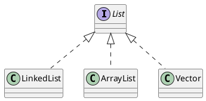

TEXTO TOPO{style="font-size: 2pc;margin-left: auto;margin-right: auto; width: 20em;text-align: center;"}

TEXTO CENTRO{style="font-size: 2pc;margin-top: 7em;margin-left: auto;margin-right: auto; width: 20em;text-align: center;"}

TEXTO BAIXO{style="font-size: 2pc;margin-top: 7em;margin-left: auto;margin-right: auto; width: 20em;text-align: center;"}

[[TOC]]

!!! note

    This is the **note** admonition body

    !!! danger Danger Title
        This is the **danger** admonition body

!!! danger ""
    This is the danger admonition body

!!! note note
    This is

!!! summary summary
    This is

!!! abstract abstract
    This is

---

!!! tldr tldr
    This is

!!! info info
    This is

!!! todo todo
    This is

!!! tip tip
    This is

!!! hint hint
    This is

!!! success success
    This is

!!! check check
    This is

!!! done done
    This is

!!! question question
    This is

!!! help help
    This is

!!! faq faq
    This is

!!! warning warning
    This is

!!! attention attention
    This is

!!! caution caution
    This is

!!! failure failure
    This is

!!! fail fail
    This is

!!! missing missing
    This is

!!! danger danger
    This is

!!! error error
    This is

!!! bug bug
    This is

!!! example example
    This is

!!! snippet snippet
    This is

!!! quote quote
    This is

!!! cite cite
    This is

Go to 
[简体中文](#简体中文), 
[Español Título](#Español-Título).

## 简体中文

Lorem ipsum dolor sit amet, consectetur adipiscing elit. 
Aenean euismod bibendum laoreet.

## Español Título

Lorem ipsum dolor sit amet, consectetur adipiscing elit. 
Aenean euismod bibendum laoreet.

Here is a footnote reference,[^1] and another.[^longnote]

[^1]: Here is the footnote.
[^longnote]: Here's one with multiple blocks.

*[HTML]: Hyper Text Markup Language
*[W3C]:  World Wide Web Consortium
The HTML specification
is maintained by the W3C.

Apple
:   Pomaceous fruit of plants of the genus Malus in the family Rosaceae.

29^th^, H~2~O

[ ] unchecked
[x] checked

item **bold red**{style="color:red"}

[[Ctrl+Esc]]

::::: container
:::: row
::: col-xs-6 alert alert-success
success text
:::
::: col-xs-6 alert alert-warning
warning text
:::
::::
:::::

::::: container
:::: row align-items-center
::: col

     
    <b>Figura 1</b>  the new keyboard..wonder if it's good

:::
:::  col

:::
::::
:::::

 - A parte física do sistema computador denominamos hardware. 
 - Aos programas, essenciais à sua conveniente utilização na solução dos problemas, chamamos software. 
 - Ao pessoal, capaz de conduzir hardware e software, denominamos peopleware.

---  

### 1.1.3. Hardware

- Todo computador é composto de duas pares essenciais para o seu funcionamento: hardware e software. Sem uma dessas partes, ele não pode funcionar.
- Para entender melhor o que isso significa, pense em um carro, composto de uma parte mecânica e outra elétrica. 
- O carro não funciona apenas com uma parte, pois é impossível dar a partida sem a ignição (pare elétrica) ou dirigi-lo sem o volante (parte mecânica).

---  

     
    <b>Figura 1</b>  the new keyboard..wonder if it's good

---  

  
### 1.1.4. Exemplo Fluxo

```mermaid
graph TD
A(Bloco 1) --> C(Bloco 2)
C --> D{Condição <br/> complexa}

    D --S--> E(Bloco 3)
    E --> I(Bloco 4)
    I-->G(( ))


    D --N--> F(Bloco 5)
    F-->G(( ))

G(( ))-->H(Bloco 6)

classDef orange fill:#f96,stroke:#333,stroke-width:2px;
class D orange
classDef black fill:#000;
class G black
```

Exemplo Fluxo

 
$$ A = a \times b $$ (1)

$$ A = a \times b $$ (3.2)

| Command                       | Keyboard Shortcut          |
| ----------------------------- | -------------------------- |
| Format: Toggle Bold           | [[Ctrl+B]]|
| Format: Toggle Italics        | [[Ctrl+I]]|
| Format: Toggle Underline      | [[Ctrl+U]]|
| Format: Toggle Mark           | [[Ctrl+M]]|
| Format: Toggle Strikethrough  | [[Alt+S]]|
| Format: Toggle Code Inline    | [[Alt+`]]|
| Format: Toggle Code Block     | [[Alt+Shift+`]]|
| Format: Toggle Block Quote    | [[Ctrl+Shift+Q]]|
| Format: Toggle Superscript    | [[Ctrl+Shift+U]]|
| Format: Toggle Subscript      | [[Ctrl+Shift+L]]|
| Format: Toggle Unordered List | [[Ctrl+L, Ctrl+U]]|
| Format: Toggle Ordered List   | [[Ctrl+L, Ctrl+O]]|
| Table: Paste as Table         | [[Ctrl+Shift+T, Ctrl+Shift+P]]|
| Table: Format Table           | [[Ctrl+Shift+T, Ctrl+Shift+F]]|
| Table: Add Columns to Left    | [[Ctrl+Shift+T, Ctrl+Shift+L]]|
| Table: Add Columns to Right   | [[Ctrl+Shift+T, Ctrl+Shift+R]]|
| Table: Add Rows Above         | [[Ctrl+Shift+T, Ctrl+Shift+A]]|
| Table: Add Row Below          | [[Ctrl+Shift+T, Ctrl+Shift+B]]|
| Table: Delete Rows            | [[Ctrl+Shift+D, Ctrl+Shift+R]]|
| Table: Delete Columns         | [[Ctrl+Shift+D, Ctrl+Shift+C]]|
| Table: Move Columns Left      | [[Alt+←]]|
| Table: Move Columns Right     | [[Alt+→]]|

