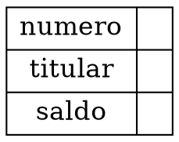
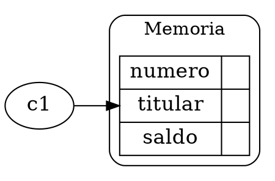
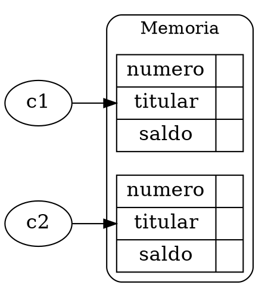
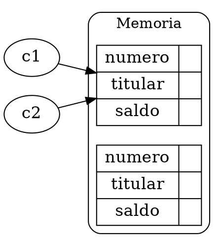
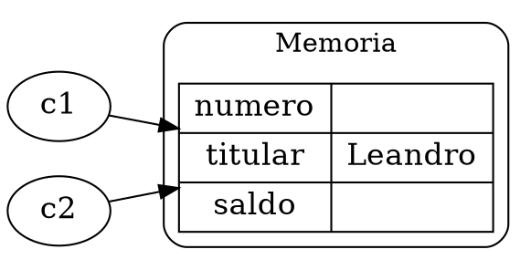
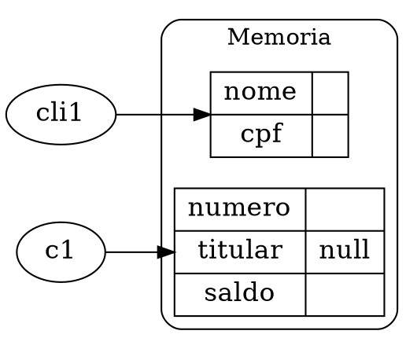
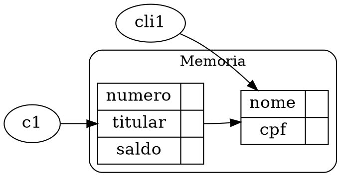
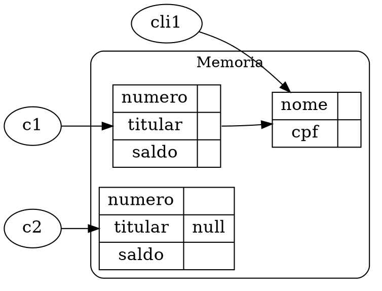
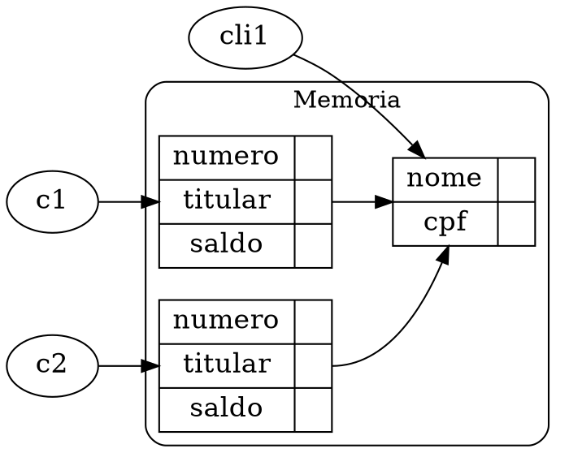
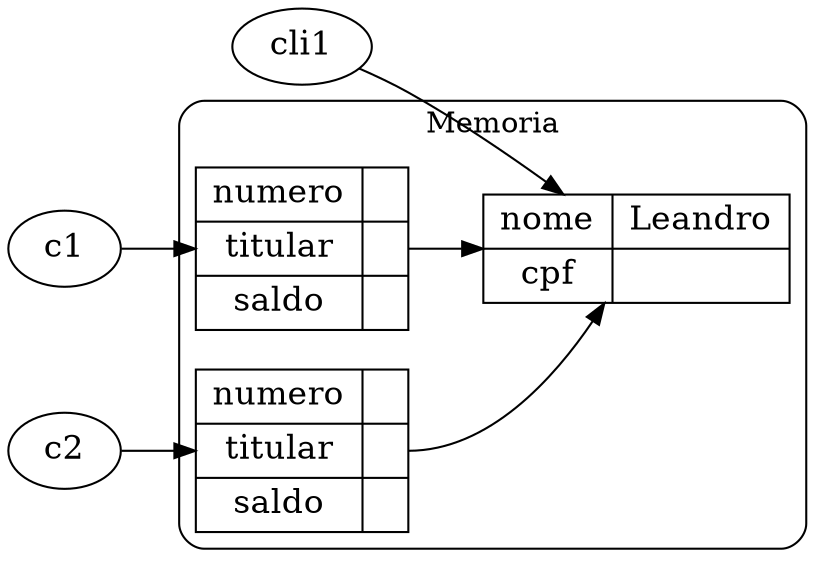

::::: container-fluid
:::: row align-items-center
::: col

```java
class Conta {
    int numero;
    String titular;
    double saldo;
}
```

:::
:::  col col-lg-4



:::
::::
:::::

<div style="page-break-after: always;"></div>

::::: container-fluid
:::: row align-items-center
::: col


```java
class Programa {
    public static void main(String[] args) {
        Conta c1;
        c1 = new Conta();
    }
}
```
:::
:::  col col-lg-4


:::
::::
:::::

<div style="page-break-after: always;"></div>

::::: container-fluid
:::: row align-items-center
::: col

```java
class Programa {
    public static void main(String[] args) {
        Conta c1 = new Conta();
        Conta c2 = new Conta();
    }
}
```
:::
:::  col col-lg-4


:::
::::
:::::

<div style="page-break-after: always;"></div>

::::: container-fluid
:::: row align-items-center
::: col

```java
class Programa {
    public static void main(String[] args) {
        Conta c1 = new Conta();
        Conta c2 = new Conta();
        c2 = c1;
    }
}
```
:::
:::  col col-lg-4


:::
::::
:::::

<div style="page-break-after: always;"></div>

::::: container-fluid
:::: row align-items-center
::: col


```java
class Programa {
    public static void main(String[] args) {
        Conta c1 = new Conta();
        Conta c2 = new Conta();
        c2 = c1;
        c2.titular = "Leandro";
    }
}
```
:::
:::  col col-lg-4



:::
::::
:::::

<div style="page-break-after: always;"></div>

::::: container-fluid
:::: row align-items-center
::: col

```java
class Conta {
    int numero;
    Cliente titular;
    double saldo;
}
class Cliente{
    String nome;
    String cpf;
}
class Programa {
    public static void main(String[] args) {
        Conta c1 = new Conta();
        Cliente cli1 = new Cliente();
    }
}
```
:::
:::  col col-lg-4


:::
::::
:::::


<div style="page-break-after: always;"></div>

::::: container-fluid
:::: row align-items-center row-no-gutters
::: col-xs-12 col-md-8

```java
class Programa {
    public static void main(String[] args) {
        Conta c1 = new Conta();
        Cliente cli1 = new Cliente();
        c1.titular = cli1;
    }
}
```
:::
:::  col-xs-6 col-md-4



:::
::::
:::::

<div style="page-break-after: always;"></div>

::::: container-fluid
:::: row align-items-center row-no-gutters
::: col-xs-12 col-md-8

```java
class Programa {
    public static void main(String[] args) {
        Conta c1 = new Conta();
        Cliente cli1 = new Cliente();
        c1.titular = cli1;
        Conta c2 = new Conta();
    }
}
```
:::
:::  col-xs-6 col-md-4



:::
::::
:::::

<div style="page-break-after: always;"></div>

::::: container-fluid
:::: row align-items-center row-no-gutters
::: col-xs-12 col-md-8

```java
class Programa {
    public static void main(String[] args) {
        Conta c1 = new Conta();
        Cliente cli1 = new Cliente();
        c1.titular = cli1;
        Conta c2 = new Conta();
        c2.titular = cli1;
    }
}
```
:::
:::  col-xs-6 col-md-4



:::
::::
:::::

<div style="page-break-after: always;"></div>

::::: container-fluid
:::: row align-items-center row-no-gutters
::: col-xs-12 col-md-8

```java
class Programa {
    public static void main(String[] args) {
        Conta c1 = new Conta();
        Cliente cli1 = new Cliente();
        c1.titular = cli1;
        Conta c2 = new Conta();
        c2.titular = cli1;
        cli1.nome = "Leandro";
    }
}
```
:::
:::  col-xs-6 col-md-4


:::
::::
:::::
