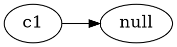
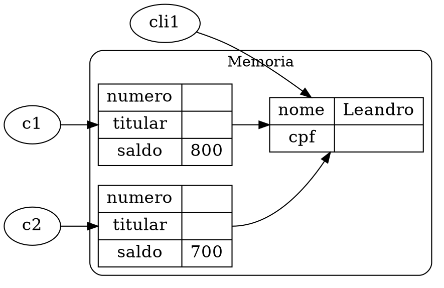

::::: container-fluid
:::: row align-items-center
::: col

```java
class Conta {
    int numero;
    String titular;
    double saldo;
}
```

:::
:::  col col-lg-4


:::
::::
:::::

<div style="page-break-after: always;"></div>

::::: container-fluid
:::: row align-items-center
::: col


```java
class Programa {
    public static void main(String[] args) {
        Conta c1 = null;        
    }
}
```
:::
:::  col col-lg-4


:::
::::
:::::

<div style="page-break-after: always;"></div>

::::: container-fluid
:::: row align-items-center
::: col


```java
class Programa {
    public static void main(String[] args) {
        Conta c1;
        c1 = new Conta();
    }
}
```
:::
:::  col col-lg-4


:::
::::
:::::

<div style="page-break-after: always;"></div>

::::: container-fluid
:::: row align-items-center
::: col

```java
class Programa {
    public static void main(String[] args) {
        Conta c1 = new Conta();
        Conta c2 = new Conta();
    }
}
```
:::
:::  col col-lg-4


:::
::::
:::::

<div style="page-break-after: always;"></div>

::::: container-fluid
:::: row align-items-center
::: col

```java
class Programa {
    public static void main(String[] args) {
        Conta c1 = new Conta();
        Conta c2 = new Conta();
        c2 = c1;
    }
}
```
:::
:::  col col-lg-4


:::
::::
:::::

<div style="page-break-after: always;"></div>

::::: container-fluid
:::: row align-items-center
::: col


```java
class Programa {
    public static void main(String[] args) {
        Conta c1 = new Conta();
        Conta c2 = new Conta();
        c2 = c1;
        c2.titular = "Leandro";
    }
}
```
:::
:::  col col-lg-4


:::
::::
:::::

<div style="page-break-after: always;"></div>

::::: container-fluid
:::: row align-items-center
::: col

```java
class Conta {
    int numero;
    Cliente titular;
    double saldo;
}
class Cliente{
    String nome;
    String cpf;
}
class Programa {
    public static void main(String[] args) {
        Conta c1 = new Conta();
        Cliente cli1 = new Cliente();
    }
}
```
:::
:::  col col-lg-4


:::
::::
:::::


<div style="page-break-after: always;"></div>

::::: container-fluid
:::: row align-items-center row-no-gutters
::: col-xs-12 col-md-8

```java
class Programa {
    public static void main(String[] args) {
        Conta c1 = new Conta();
        Cliente cli1 = new Cliente();
        c1.titular = cli1;
    }
}
```
:::
:::  col-xs-6 col-md-4


:::
::::
:::::

<div style="page-break-after: always;"></div>

::::: container-fluid
:::: row align-items-center row-no-gutters
::: col-xs-12 col-md-8

```java
class Programa {
    public static void main(String[] args) {
        Conta c1 = new Conta();
        Cliente cli1 = new Cliente();
        c1.titular = cli1;
        Conta c2 = new Conta();
    }
}
```
:::
:::  col-xs-6 col-md-4


:::
::::
:::::

<div style="page-break-after: always;"></div>

::::: container-fluid
:::: row align-items-center row-no-gutters
::: col-xs-12 col-md-8

```java
class Programa {
    public static void main(String[] args) {
        Conta c1 = new Conta();
        Cliente cli1 = new Cliente();
        c1.titular = cli1;
        Conta c2 = new Conta();
        c2.titular = cli1;        
    }
}
```
:::
:::  col-xs-6 col-md-4


:::
::::
:::::

<div style="page-break-after: always;"></div>

::::: container-fluid
:::: row align-items-center row-no-gutters
::: col-xs-12 col-md-8

```java
class Programa {
    public static void main(String[] args) {
        Conta c1 = new Conta();
        Cliente cli1 = new Cliente();
        c1.titular = cli1;
        Conta c2 = new Conta();
        c2.titular = cli1;
        cli1.nome = "Leandro";
    }
}
```
:::
:::  col-xs-6 col-md-4


:::
::::
:::::


<div style="page-break-after: always;"></div>


```java

class Programa {
    public static void main(String[] args) {
        Conta c1 = new Conta();
        Cliente cli1 = new Cliente();
        c1.titular = cli1;
        Conta c2 = new Conta();
        c2.titular = cli1;
        cli1.nome = "Leandro";
        c1.deposita(1000);
        c2.deposita(500);
        c1.transfere(200, c2);
    }
}

 class Conta {
	private int numero;
	private Cliente cliente;
	private double saldo;	

	public void deposita(double valor) {
		saldo = saldo + valor;
	}
	
	public boolean saca(double valor) {
		if (valor <= saldo) {
			saldo = saldo - valor;
			return true;
		}
		return false;
	}

	public boolean transfere(Conta destino, double valorTransferencia) {
		if (saca(valorTransferencia)) {
			destino.deposita(valorTransferencia);
			return true;
		}
		return false;
	}
	
  
}
```
::::: container-fluid
:::: row align-items-center
::: col

```plantuml
Programa->c1 :"deposita(1000)"
Programa->c2 :"deposita(500)"
Programa->c1 :"transfere(c2,200)"
c1->c1 :"saca(200)"
c1->c2 :"deposita(200)"

```
:::
:::  col col-lg-6


:::
::::
:::::