# Exercicios condicional 

1. Ler cinco valores numéricos inteiros, identificar e apresentar o maior e o menor valores informados. Não execute a ordenação dos valores

```mermaid
graph TD

B10(Leia num)
B11(maior <- num)
B12(menor <- num)

B10 --> B11 --> B12 

B12 --> T10{num > maior}
    T10 --S--> B15(maior <-num )
    T10 --N--> F10(( ))
    B15 --> F10(( ))

F10 --> T11{num < menor}
    T11 --S--> B16(menor <-num )
    T11 --N--> F11(( ))
    B16 --> F11(( ))

F11 --> T20{num2 > maior}
    T20 --S--> B25(maior <-num2 )
    T20 --N--> F20(( ))
    B25 --> F20(( ))

F20 --> T31{num2 < menor}
    T31 --S--> B26(menor <-num2 )
    T31 --N--> F21(( ))
    B26 --> F21(( ))

F21 --> T30{num3 > maior}
    T30 --S--> B35(maior <-num3 )
    T30 --N--> F30(( ))
    B35 --> F30(( ))

F30 --> T21{num3 < menor}
    T21 --S--> B36(menor <-num3 )
    T21 --N--> F31(( ))
    B36 --> F31(( ))


B40(...)
B50(escreva maior)
B51(escreva menor)

F31 --> B40 --> B50 --> B51

    classDef orange fill:#f96,stroke:#333,stroke-width:2px;
class T10,T11,T20,T21,T30,T31 orange
classDef black fill:#000;
class F10,F11,F20,F21,F30,F31 black
```


código 

```
Algoritmo "maiormenor"

Var

   num, maior, menor :inteiro

Inicio
   Escreva ("informe o primeiro numero ")
   Leia (num)
   maior <- num
   menor <- num

   Escreva ("informe o segundo numero ")
   Leia (num)
   se num > maior entao
      maior <- num
   fimse

   se num < menor entao
      menor <- num
   fimse

   Escreva ("informe o terceiro numero ")
   Leia (num)
   se num > maior entao
      maior <- num
   fimse

   se num < menor entao
      menor <- num
   fimse

   Escreva ("informe o quarto numero ")
   Leia (num)
   se num > maior entao
      maior <- num
   fimse

   se num < menor entao
      menor <- num
   fimse

   Escreva ("informe o quinto numero ")
   Leia (num)
   se num > maior entao
      maior <- num
   fimse

   se num < menor entao
      menor <- num
   fimse

   escreval ("O maior numero é ", maior)
   escreval ("O menor numero é ",menor)

Fimalgoritmo
```
