# Exercícios condicional 

1. Ler cinco valores numéricos inteiros, identificar e apresentar o maior e o menor valores informados. Não execute a ordenação dos valores

```mermaid
graph TD
B1(Escreva informe o primeiro numero)
B2(Escreva informe o segundo numero)
B3(Leia num2)
B4(Escreva informe o terceiro numero)
B5(Leia num3)
B6(Escreva informe o quarto numero)
B7(Leia num4)
B8(Escreva informe o quinto numero)
B9(Leia num5)

B10(Leia num1)
B11(maior <- num1)
B12(menor <- num1)

B1 --> B10
B10 --> B11
B11 --> B12 

B12 --> T10{num1 > maior}
    T10 --S--> B15(maior <-num1 )
    T10 --N--> F10(( ))
    B15 --> F10(( ))

F10 --> T11{num1 < menor}
    T11 --S--> B16(menor <-num1 )
    T11 --N--> F11(( ))
    B16 --> F11(( ))

F11 --> B2
B2 --> B3
B3 --> T20{num2 > maior}
    T20 --S--> B25(maior <-num2 )
    T20 --N--> F20(( ))
    B25 --> F20(( ))

F20 --> T21{num2 < menor}
    T21 --S--> B26(menor <-num2 )
    T21 --N--> F21(( ))
    B26 --> F21(( ))

F21 --> B4
B4 --> B5
B5 --> T30{num3 > maior}
    T30 --S--> B35(maior <-num3 )
    T30 --N--> F30(( ))
    B35 --> F30(( ))

F30 --> T31{num3 < menor}
    T31 --S--> B36(menor <-num3 )
    T31 --N--> F31(( ))
    B36 --> F31(( ))


F31 --> B6
B6 --> B7
B7 --> T40{num4 > maior}
    T40 --S--> B45(maior <-num4 )
    T40 --N--> F40(( ))
    B45 --> F40(( ))

F40 --> T41{num4 < menor}
    T41 --S--> B46(menor <-num4 )
    T41 --N--> F41(( ))
    B46 --> F41(( ))


F41 --> B8
B8 --> B9
B9 --> T50{num5 > maior}
    T50 --S--> B55(maior <-num5 )
    T50 --N--> F50(( ))
    B55 --> F50(( ))

F50 --> T51{num5 < menor}
    T51 --S--> B56(menor <-num5 )
    T51 --N--> F51(( ))
    B56 --> F51(( ))

F51 --> B60(Escreva maior)
B60 --> B61(Escreva menor) 

classDef orange fill:#f96,stroke:#333,stroke-width:2px;
class T10,T11,T20,T21,T30,T31,T40,T41,T50,T51 orange
classDef black fill:#000;
class F10,F11,F20,F21,F30,F31,F40,F41,F50,F51 black
```



<div style="page-break-after: always;"></div>

código 

```php
Algoritmo "maiormenor"

Var

   num1,num2,num3,num4,num5, maior, menor :inteiro

Inicio
   Escreva ("informe o primeiro numero ")
   Leia (num1)
   maior <- num1
   menor <- num1

   Escreva ("informe o segundo numero ")
   Leia (num2)
   se num2 > maior entao
      maior <- num2
   fimse

   se num2 < menor entao
      menor <- num2
   fimse

   Escreva ("informe o terceiro numero ")
   Leia (num3)
   se num3 > maior entao
      maior <- num3
   fimse

   se num3 < menor entao
      menor <- num3
   fimse

   Escreva ("informe o quarto numero ")
   Leia (num4)
   se num4 > maior entao
      maior <- num4
   fimse

   se num4 < menor entao
      menor <- num4
   fimse

   Escreva ("informe o quinto numero ")
   Leia (num5)
   se num5 > maior entao
      maior <- num5
   fimse

   se num5 < menor entao
      menor <- num5
   fimse

   escreval ("O maior numero é ", maior)
   escreval ("O menor numero é ",menor)

Fimalgoritmo
```

<div style="page-break-after: always;"></div>

2.  Ler três valores e apresentá-los dispostos em ordem crescente. Utilizar os conceitos de propriedade distributiva (exercício "g" do capítulo 3) e troca de valores entre variáveis (exercício "f" do capítulo 3).