```plantuml
@startuml
  digraph G {
    graph [pad="0.212,0.055" bgcolor=lightgray];
    node [style=filled];
    a [fillcolor="#d62728" pos="0,0!"];
    b [fillcolor="#1f77b4" pos="0,1!"];
    c [fillcolor="#2ca02c" pos="2,2!"];
    d [fillcolor="#ff7f0e" pos="-1,0!"];
    a -> b;
    a -> c;
    a -> d;
  }
@enduml
```

```plantuml
@startuml
digraph G {
    // we create the two nodes to be displayed
    node[ shape = "box" ];
    a b;
    //we also create four empty nodes for routing the edges
    node[shape = box, label="", height=0, width=0];
    x1 x2 x3 x4;
    // we make sure that the nodes are arranged on the right levels
    { rank = same; x1 a x2 }
    { rank = same; x3 b x4 }

    // we draw the edges one by one as the heads are varying
    x1 -> a[ dir = none, headclip="false",tailclip="false"];
    a -> x2[ dir = back , headclip="false",tailclip="false"];
    x1 -> x3[ dir = none , headclip="false",tailclip="false"];
    x2 -> x4[ dir = none, headclip="false",tailclip="false"];
    b -> x4[ dir = none, headclip="false",tailclip="false"];
    x3 -> b[headclip="false",tailclip="false"];
}
@enduml
```

