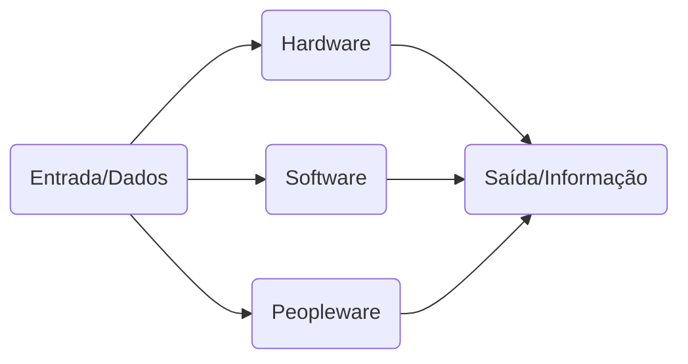
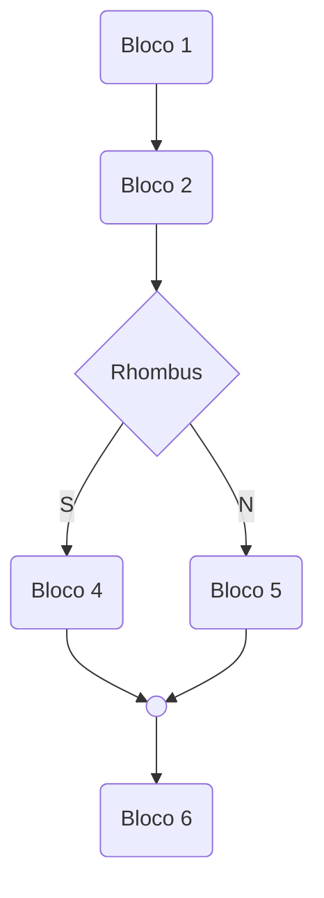

[[TOC]]

# Lógica de Programação

## Introdução

### Evolução dos computadores

- Desde o ábaco, passando pela maquina de somar de Pascal até os equipamentos mais modernos o princípio de funcionamento é o mesmo.
	- Em todos, sem exceção, é possível considerar três subsistemas hardware, software e peopleware.

### Sistema computacional

 - A parte física do sistema computador denominamos hardware. 
 - Aos programas, essenciais à sua conveniente utilização na solução dos problemas, chamamos software. 
 - Ao pessoal, capaz de conduzir hardware e software, denominamos peopleware.

### Hardware

- Todo computador é composto de duas pares essenciais para o seu funcionamento: hardware e software. Sem uma dessas partes, ele não pode funcionar.
- Para entender melhor o que isso significa, pense em um carro, composto de uma parte mecânica e outra elétrica. 
- O carro não funciona apenas com uma parte, pois é impossível dar a partida sem a ignição (pare elétrica) ou dirigi-lo sem o volante (parte mecânica).

    
    <b>Figura 1</b>  the new keyboard..wonder if it's good

  

  
#### Exemplo Fluxo

